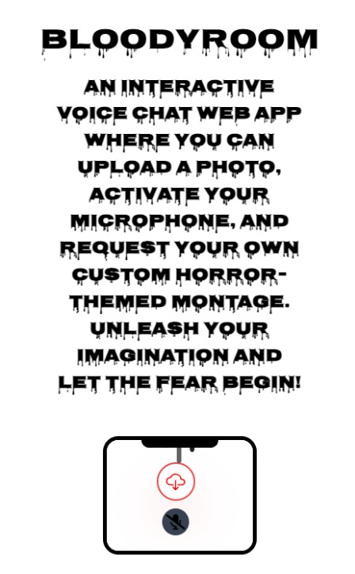

# Bloody Room

## Description

**Bloody Room** is a Halloween-themed web application where users can register and are given 4 tokens per day to upload 4 images and change their backgrounds. This interactive app uses voice commands to let users request custom horror-themed montages. Simply upload a photo, use your microphone, and say things like "Change the background to..." and the app will generate the result. It may take some time to process the image. Additionally, the gallery features a vertical carousel on desktop and a horizontal one on mobile, displaying the uploaded images.

## Usage

1. **Landing Page**: Upon visiting the landing page, you'll find a description of the project, a small gallery, a call-to-action (CTA) button to register, and a section introducing the project team.
2. **Registration**: Users can register using Google Authentication, powered by Firebase.

3. **Image Upload and Customization**: Once registered, users can upload images. After the image is uploaded, use your voice to give commands like "Change the background to..." to customize the image. The voice command feature uses your microphone, and the image generation process may take a little time.

4. **Gallery View**: Uploaded images are shown in a gallery. On desktop, the image carousel is displayed vertically on the right side of the screen. On mobile, it appears horizontally below the selected image.

## Limitations and Rules

- You can only generate up to **4 images per day**. Tokens will be reloaded **24 hours** after the last image upload.
- **No inappropriate language**: Keep the commands clean.
- Speak **clearly and loudly** to ensure the voice recognition works effectively.

## Dependencies

- `@react-three/drei`: ^9.114.3
- `@react-three/fiber`: ^8.17.10
- `@types/three`: ^0.169.0
- `firebase`: ^10.14.1
- `firebase-admin`: ^12.6.0
- `framer-motion`: ^11.11.8
- `next`: 14.2.15
- `next-cloudinary`: ^6.14.1
- `react`: ^18
- `react-dom`: ^18
- `react-icons`: ^5.3.0
- `sonner`: ^1.5.0
- `three`: ^0.169.0
- `zustand`: ^5.0.0
